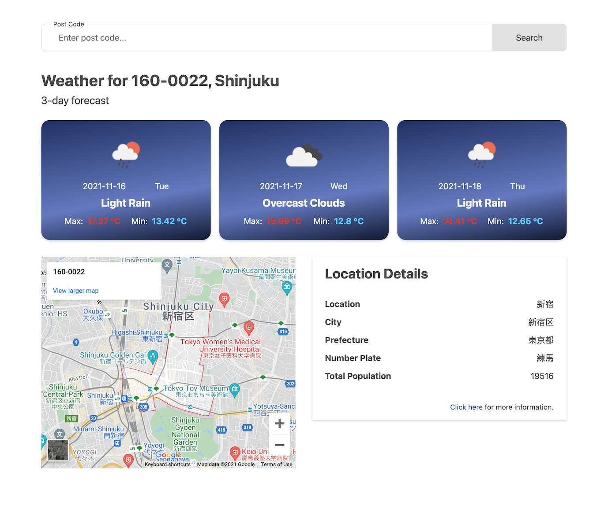
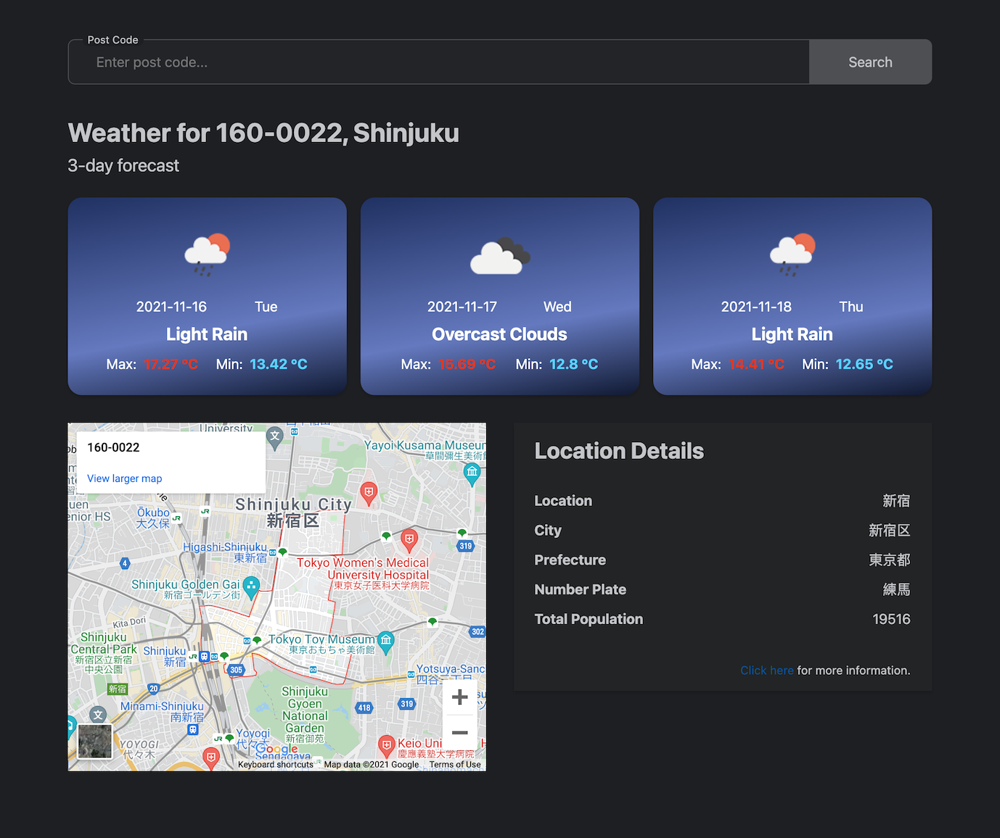
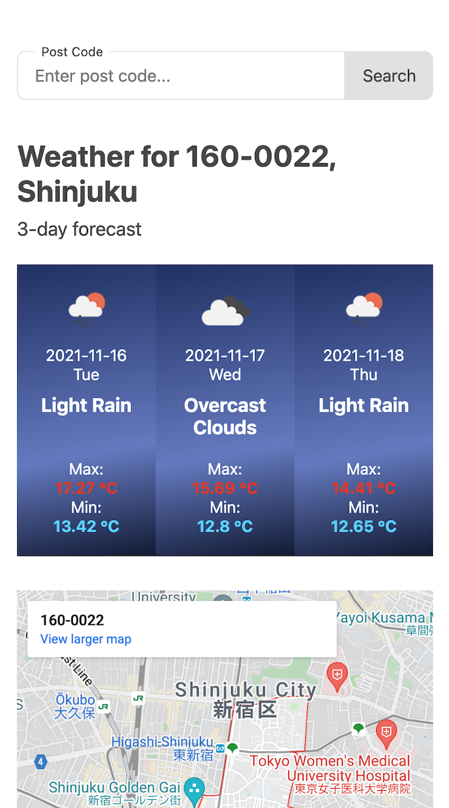
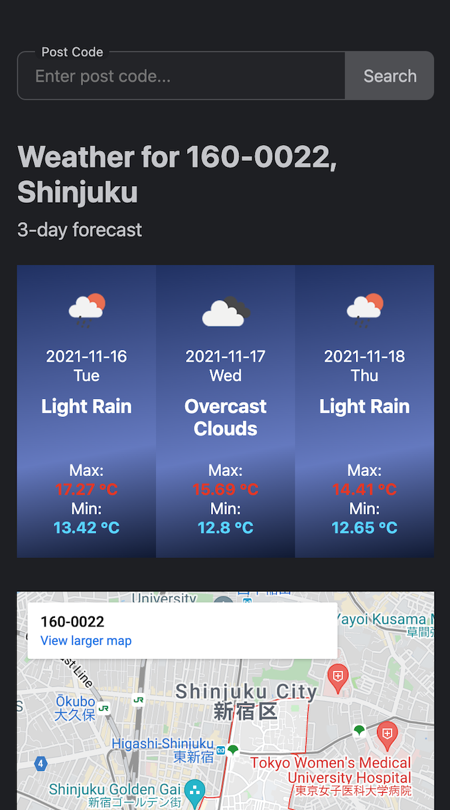

# Assignment for Weather / Location application

Assignment for a job application. Goal of the application is to display a map and weather data (3 days forecast) based on a post code the user inputs.

The app is built with Svelte. Supporting responsive resolutions as wellas light/dark mode (based on user's device/browser settings).

API usage:

- [Google Maps Embed API](https://developers.google.com/maps/documentation/embed/get-started): For displaying the area of a given post code.
- [OpenWeather API](https://openweathermap.org/api/one-call-api#data): To fetch weather data for the location.
- [Wikipedia API](https://www.mediawiki.org/wiki/API:Search): To provice some additional data from the Wikipedia page. _(No API key required)_

## Preview






## Get started

_Note that you will need to have [Node.js](https://nodejs.org) installed._

Add valid API keys to `src/config.js` file

```js
export default {
  MAPS_API_KEY: 'INSERT_YOUR_GOOGLE_MAP_API_KEY',
  WEATHER_API_KEY: 'INSERT_YOUR_OPEN_WEATHER_API_KEY',
}
```

Install the dependencies...

```bash
cd svelte-app
npm install
```

...then start [Rollup](https://rollupjs.org):

```bash
npm run dev
```

Navigate to [localhost:5000](http://localhost:5000). You should see your app running.

## Building and running in production mode

To create an optimised version of the app:

```bash
npm run build
```

You can run the newly built app with `npm run start`.
